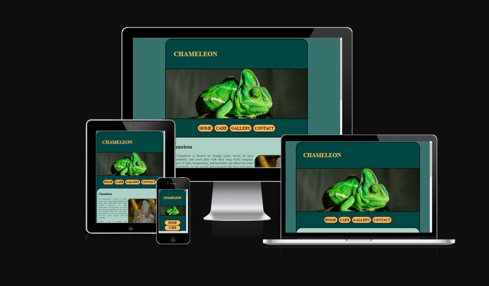
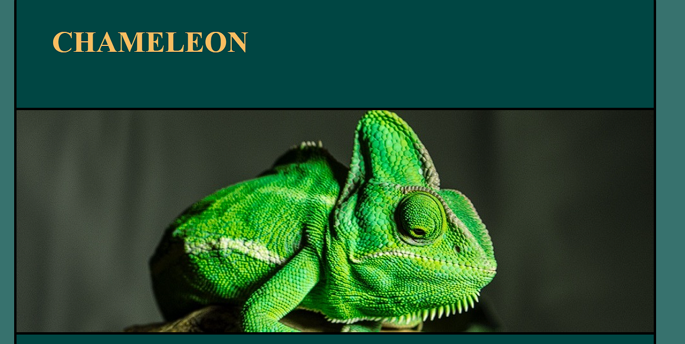
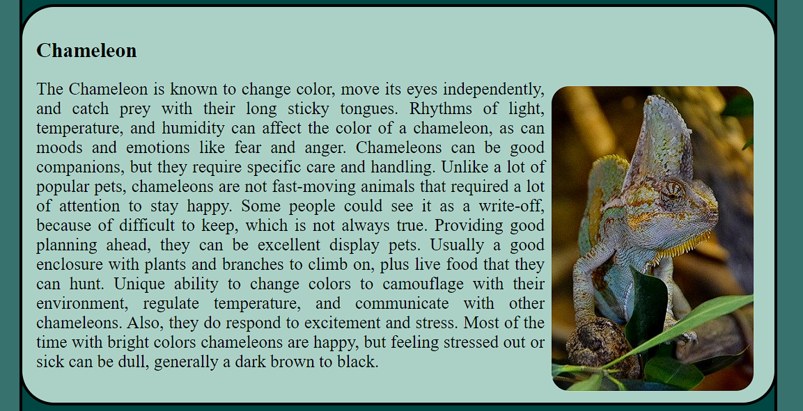
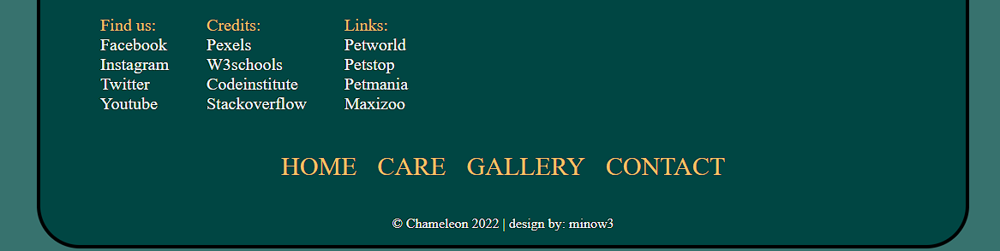
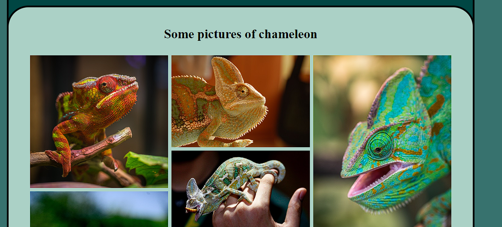
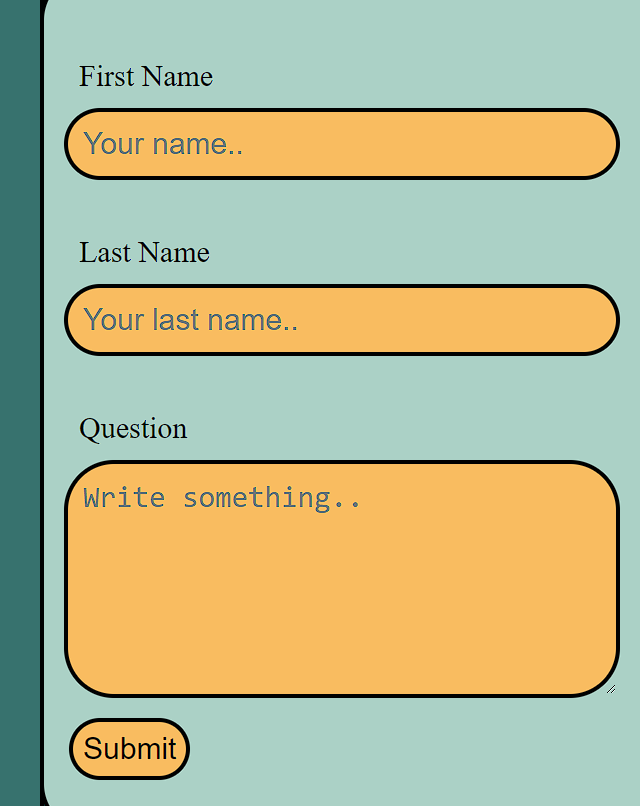
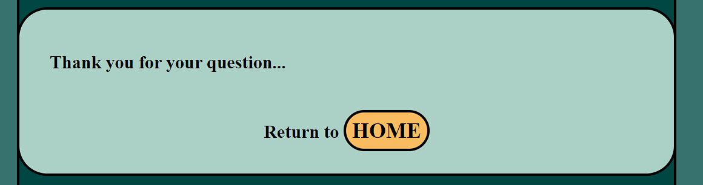
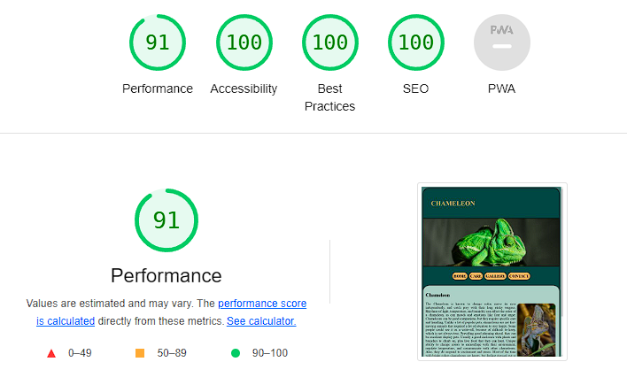
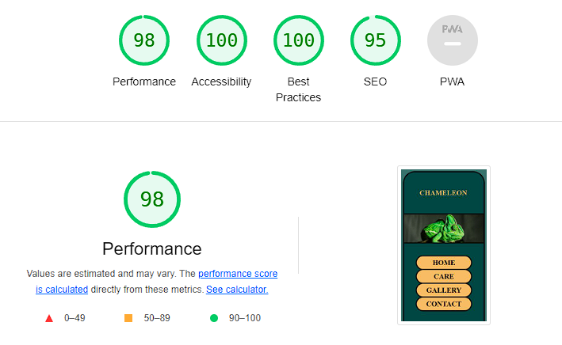

# Chameleon

The chameleon website is for people curious about  animals and seeking additional information. Page providing description about a chameleon and most basic care guidelines. Users on this website will find links where they can buy this pet and where they can see it live, before making a decision. The website provides a contact form, which is going to answer some of the questions.

# Features

- __The Header__

  - On top of The Header shows a clear page name Chameleon on dark teal background.
  - Shows a picture that describes the page content.

- __Navigation__

  - Added yellow buttons in the dark teal background for clear visual appeal and easy access to it.
  
  

- __Home Page__

  - This section provides information about animals accompanied by a picture.
  
 
 
- __Footer__

  - In Footer included social links where they can find more frequent content.
  - The footer shows credit information on what sources were used on a website.
  - included additional links for web stores, where users can look and buy animals.
  - Added navigation for quick access to content.

- __The Gallery__

  - Provided supporting pictures for users of what a colorful animal is a chameleon.

- __Contact form__

  - The contact page has a form to pass users' questions and queries.
  - The form collects the user's name, surname, email, and question or query.

- __After Submition__

  - This page was created for better user transition back to the page.
 

# Testing

  - I tested that this page works on devices: PC, Amazon tablet, 55inch Samsung TV, Nintendo Switch, Xiaomi Phone.
  - Tested on multiple browsers: Opera, Chrome, Edge.
  - I confirmed that this project is responsive, good looking in most screen sizes.
  - I confirmed that all text is readable on most devices.
  - Header, navigation, footer, contact form are readable and easy to understand.
  - I confirmed that contact form works: requires entries in every field and submit button works.

# Bugs

- Images won't fit in screen in mobile version.
- I discovered while using phone.
- Fixed with  max-width: 100%;

# Validator testing

- __HTML__
  - No errors were returned when passing through the official W3C validator
- __CSS__
  - No errors were found when passing through the official (Jigsaw) validator
- __Accessibility__
  - I confirm that the colors and fonts chosen are easy to read and accessible by running it through lighthouse in devtools

  - Desktop version:

  - Mobile version:

# Unfixed Bugs

  - No unfixed bugs

# Deployment

- The site was deployed to GitHub pages. The steps to deploy are as follows: 
  - In the GitHub repository, navigate to the Settings tab 
  - From the source section drop-down menu, select the Master Branch
  - Once the master branch has been selected, the page provides the link to the completed site.

The live link can be found here - [Chameleon](https://minow3.github.io/Chameleon/index.html)

# Credits

- __Content__

  - All information was taken from [PetKeen](https://petkeen.com/do-chameleons-make-good-pets/) website.

- __Media__

  - Pictures were taken from our trusted source [Pexels](http://www.pexels.com)

- __Code__

  - Gallery code was used from [W3School](https://www.w3schools.com/howto/howto_css_image_grid_responsive.asp)
