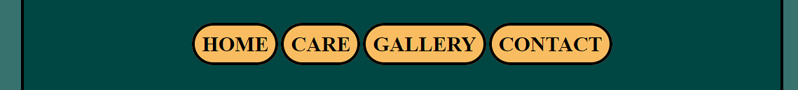

# Chameleon

The chameleon website is for people curious about  animals and seeking additional information. Page providing description about a chameleon and most basic care guidelines. Users on this website will find links where they can buy this pet and where they can see it live, before making a decision. The website provides a contact form, which is going to answer some of the questions.

# Features

- __The Header__

  - The Header shows a clear page name on dark teal background.
  -  Shows a picture that describes the page content.

- __Navigation__

  - Added yellow buttons in the dark teal background for clear visual appeal and easy access to it.
  
  

- __Home Page__

  - This section provides information about animals accompanied by a picture.
  
 
 
- __Footer__

  - In Footer included social links where they can find more frequent content.
  - The footer shows credit information on what sources were used on a website.
  - included additional links for web stores, where users can look and buy animals.
  - Added navigation for quick access to content.

- __The Gallery__

  - Provided supporting pictures for users of what a colorful animal is a chameleon.

